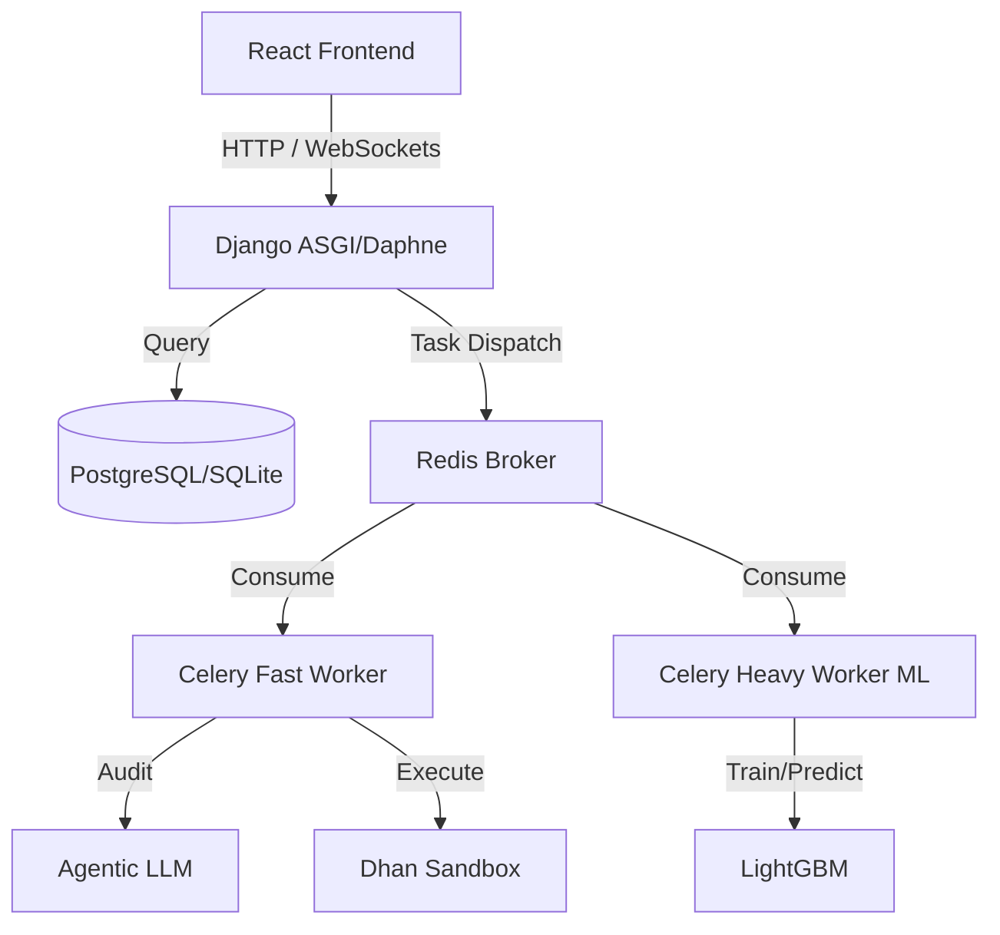

# AutoQuant - AI Quantitative Trading Platform

     

AutoQuant is an experimental autonomous quantitative trading platform (currently in active testing). It orchestrates an end-to-end data pipeline, predictive ML modeling (LightGBM), an Agentic LLM auditor for signal validation, and live execution via a distributed Celery/Redis background architecture.

---

## Key Features

- **Distributed ML Pipeline**: Ingests 8+ years of Nifty 500 market data to autonomously train and validate LightGBM momentum models.
- **Agentic LLM Auditor**: A Tier-2 AI validation layer that analyzes model predictions against fundamental metrics and macro trends to filter false positives.
- **Asynchronous Execution**: Powered by a robust Celery + Redis architecture with dedicated fast/heavy workers to prevent UI blocking during massive ML computations.
- **Live WebSocket Dashboard**: A React + Tailwind CSS frontend with a built-in `GlobalTaskMonitor` that streams real-time logs and task progress via WebSockets.
- **Multi-Environment Cloud Proxy**: One-click environment toggle to seamlessly switch the frontend dashboard between local SQLite development and the live Azure PostgreSQL production database.
- **Paper Trading & P&L Engine**: Simulates comprehensive broker fees (Zerodha, Dhan, Groww, Angel One) and tracks 15-day strict-hold trades.

---

## Architecture



---

## Quick Start: Local Development (Windows)

### Prerequisites
- Python 3.12+
- Node.js 18+
- Redis Server

### 1. Start Redis
AutoQuant requires Redis for WebSockets and Celery task routing.
**Using WSL2 (Recommended on Windows):**
```bash
wsl redis-server
```
*(Alternatively, install the native Windows Redis port from Memurai or Microsoft Archive).*

### 2. Backend Setup
Open a new terminal and set up the Django backend:
```bash
cd backend
python -m venv venv
venv\Scripts\activate
pip install -r requirements.txt

# Setup local SQLite database
python manage.py migrate
python manage.py createsuperuser

# Start Django Server (ASGI)
daphne -p 8000 config.asgi:application
```

### 3. Start Celery Workers
Since this project mimics a distributed production environment, open 3 separate terminals (with the `venv` activated in each) to monitor your queues independently:

**Terminal A: Fast Worker (Trade Executions & Fast Tasks)**
```bash
cd backend
celery -A config worker -l info -Q fast_tasks,celery -P solo
```

**Terminal B: Heavy Worker (ML Training & Inference)**
```bash
cd backend
celery -A config worker -l info -Q heavy_tasks -P solo
```

**Terminal C: Celery Beat (Cron Scheduler)**
```bash
cd backend
celery -A config beat -l info
```

### 4. Frontend Setup
Open a final terminal for the React dashboard:
```bash
cd frontend
npm install
npm run dev
```
The application will launch at **http://localhost:5173**.

---

## 🐳 Quick Start: Local Development (Docker)

Instead of managing 6 separate terminals, you can run the entire production-grade cluster on your Windows machine using Docker Desktop.

1. Ensure **Docker Desktop** is running on Windows.
2. Create a `.env` file in your root folder (copy from `.env.example`).
3. Run the cluster:
```bash
docker-compose up -d --build
```
*(Note: Running via Docker locally will spin up a fresh PostgreSQL database container instead of using your local SQLite file. Run `docker-compose exec web python manage.py migrate` to initialize it).*

---

## Production Deployment (Azure + Docker Compose)

AutoQuant is designed to be hosted autonomously on an Azure Virtual Machine via Docker Compose.

### 1. Configure Environment
Create a `.env` file in the root directory on your server:
```env
DEBUG=False
DJANGO_SECRET_KEY=your-secure-key
REDIS_URL=redis://redis:6379/0
DATABASE_URL=postgres://autoquant:secret@db:5432/autoquant_db
DHAN_CLIENT_ID=...
GEMINI_API_KEY=...
```

### 2. Deploy Containers
```bash
# Build and spin up the 6-container cluster
docker-compose up -d --build

# Run initial database migrations on the live DB
docker-compose exec web python manage.py migrate

# Create the production admin account
docker-compose exec web python manage.py createsuperuser
```

### 3. Connect Local Frontend to Azure
You can monitor your live Azure production server from your local Windows machine!
Simply open `frontend/.env` and set:
```env
VITE_BACKEND=AZURE
```
Double-click the sleek Environment Badge in your browser to instantly toggle your dashboard between **LOCAL TEST** and **AZURE CLOUD**.

---

## Daily Autonomous Pipeline (Cron)

Celery Beat is configured to run the master pipeline automatically on production.
- **3:10 PM**: `autonomous_daily_pipeline_task` fires.
- **Step 1**: Downloads today's Nifty 500 snapshot.
- **Step 2**: LightGBM ranks the top momentum candidates.
- **Step 3**: The Agentic LLM audits the top 5 candidates.
- **Step 4**: Approved trades are executed.

